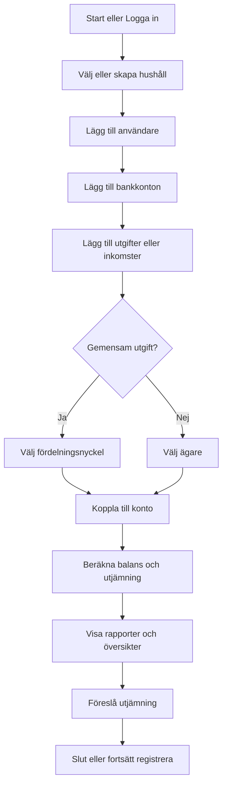

## Flödesschema för Par-ekonomi-applikation



---

## Exempel på Data (JSON-struktur)

```json
{
  "users": [
    { "id": 1, "name": "Anna" },
    { "id": 2, "name": "Bertil" }
  ],
  "accounts": [
    { "id": 1, "name": "Annas lönekonto", "ownerId": 1, "balance": 12000 },
    { "id": 2, "name": "Bertils lönekonto", "ownerId": 2, "balance": 13000 },
    { "id": 3, "name": "Gemensamt matkonto", "ownerId": null, "balance": 5000 }
  ],
  "categories": [
    { "id": 1, "name": "Hyra", "split": [60, 40] },
    { "id": 2, "name": "Mat", "split": [50, 50] },
    { "id": 3, "name": "Bensin", "split": [100, 0] }
  ],
  "transactions": [
    { "id": 1, "accountId": 3, "payerId": 1, "amount": 1000, "categoryId": 2, "date": "2025-08-01", "shared": true },
    { "id": 2, "accountId": 2, "payerId": 2, "amount": 9000, "categoryId": 1, "date": "2025-08-01", "shared": true },
    { "id": 3, "accountId": 1, "payerId": 1, "amount": 400, "categoryId": 3, "date": "2025-08-03", "shared": false }
  ]
}
```

---

## Exempel på användningsfall

**Scenario:**  
Anna och Bertil har både egna och gemensamma bankkonton.  
De vill dela på hyran 60/40, mat 50/50 och bensin betalas bara av Anna.

1. **Hyra**:  
   - Total: 9000 kr, inlagd som gemensam utgift, fördelning 60% Bertil, 40% Anna  
   - Bertil betalar hela från sitt konto.  
   - Systemet räknar ut att Anna "skuldsätter" sig 3600 kr till Bertil.

2. **Mat**:  
   - Anna betalar 1000 kr från gemensamma matkontot.  
   - Märkt som gemensam utgift, 50/50.  
   - Båda står för 500 kr var.

3. **Bensin**:  
   - Anna betalar 400 kr från sitt konto.  
   - Märkt som individuell utgift (100% Anna).

**Resultat/Saldo:**  
- Systemet visar hur mycket var och en har betalat mot sin andel för gemensamma utgifter.
- Om Anna är skyldig Bertil pengar, visas förslag på utjämning.

---

## Möjlig vy i webbappen

| Datum      | Kategori | Belopp | Vem betalat | Gemensam/Individuell | Andel Anna | Andel Bertil |
|------------|----------|--------|-------------|----------------------|------------|--------------|
| 2025-08-01 | Hyra     | 9000   | Bertil      | Gemensam 60/40       | 3600       | 5400         |
| 2025-08-01 | Mat      | 1000   | Anna        | Gemensam 50/50       | 500        | 500          |
| 2025-08-03 | Bensin   | 400    | Anna        | Individuell (Anna)   | 400        | 0            |

**Balans:**  
- Anna har betalat 1000 + 400 = 1400 kr  
- Bertil har betalat 9000 kr  
- Anna skulle enligt fördelning stå för 3600 + 500 + 400 = 4500 kr  
- Bertil skulle enligt fördelning stå för 5400 + 500 = 5900 kr  
- Systemet räknar ut och visar:  
  - Anna har kvar att betala 3100 kr till Bertil för att vara "jämna" på de gemensamma posterna.

---