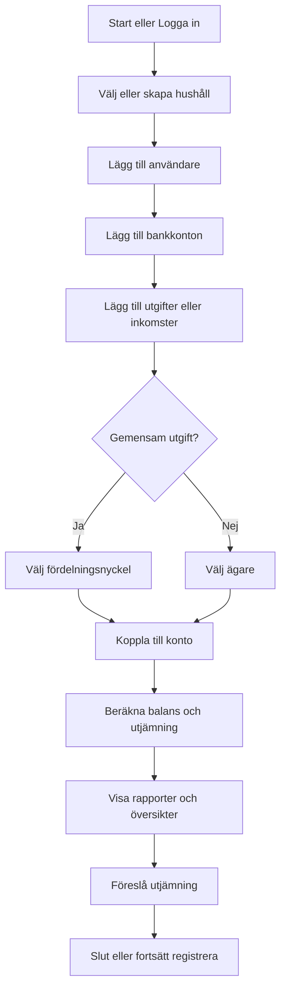

# MVP-förslag: Par-ekonomi-applikation

Detta MVP-förslag utgår från det givna flödesschemat och datamodellen. Syftet är att snabbt bygga en första fungerande version där två personer kan lägga till konton, kategorier, transaktioner och se fördelning samt utjämningsförslag.

---

## Funktionalitet i MVP

- **Skapa/ladda hushåll**
- **Lägg till/redigera användare**
- **Lägg till/redigera bankkonton (ägare: person eller gemensamt)**
- **Lägg till/redigera kategorier (fördelningsnyckel per kategori)**
- **Registrera inkomster och utgifter**
  - Ange kategori, belopp, vem som betalat, vilket konto
  - Ange om utgiften är gemensam eller individuell
- **Automatisk beräkning av andelar per person för varje transaktion**
- **Rapport: tabell som visar vem som har betalat vad och vem som är skyldig vem**
- **Förslag på utjämning**

---

## Datamodell (JSON-format)

```json
{
  "users": [
    { "id": 1, "name": "Anna" },
    { "id": 2, "name": "Bertil" }
  ],
  "accounts": [
    { "id": 1, "name": "Annas lönekonto", "ownerId": 1, "balance": 12000 },
    { "id": 2, "name": "Bertils lönekonto", "ownerId": 2, "balance": 13000 },
    { "id": 3, "name": "Gemensamt matkonto", "ownerId": null, "balance": 5000 }
  ],
  "categories": [
    { "id": 1, "name": "Hyra", "split": [60, 40] },
    { "id": 2, "name": "Mat", "split": [50, 50] },
    { "id": 3, "name": "Bensin", "split": [100, 0] }
  ],
  "transactions": [
    { "id": 1, "accountId": 3, "payerId": 1, "amount": 1000, "categoryId": 2, "date": "2025-08-01", "shared": true },
    { "id": 2, "accountId": 2, "payerId": 2, "amount": 9000, "categoryId": 1, "date": "2025-08-01", "shared": true },
    { "id": 3, "accountId": 1, "payerId": 1, "amount": 400, "categoryId": 3, "date": "2025-08-03", "shared": false }
  ]
}
```

---

## Flödesschema (mermaid)



---

## Huvudsidor i MVP

1. **Hushåll & användare**
   - Skapa hushåll och lägg till användare

2. **Bankkonton**
   - Lägg till/redigera konton, ange ägare (person eller gemensamt)

3. **Kategorier**
   - Lägg till/redigera kategorier, ange fördelningsnyckel (t.ex. 50/50)

4. **Transaktioner**
   - Lägg till transaktion (datum, kategori, belopp, betalt av, konto, gemensam/individuell)

5. **Rapport**
   - Tabell: datum, kategori, belopp, vem betalat, gemensam/individuell, andelar per person
   - Summering: vad var och en har betalat, borde ha betalat, utjämning

---

## Exempel på användningsfall

| Datum      | Kategori | Belopp | Vem betalat | Gemensam/Individuell | Andel Anna | Andel Bertil |
|------------|----------|--------|-------------|----------------------|------------|--------------|
| 2025-08-01 | Hyra     | 9000   | Bertil      | Gemensam 60/40       | 3600       | 5400         |
| 2025-08-01 | Mat      | 1000   | Anna        | Gemensam 50/50       | 500        | 500          |
| 2025-08-03 | Bensin   | 400    | Anna        | Individuell (Anna)   | 400        | 0            |

**Balans:**
- Anna har betalat 1400 kr, Bertil har betalat 9000 kr
- Anna borde ha betalat 4500 kr, Bertil 5900 kr
- System visar: Anna är skyldig Bertil 3100 kr

---

## Tekniska val för MVP

- **Statisk webbapp:** HTML, CSS, JavaScript (ingen backend i MVP)
- **LocalStorage:** Data sparas lokalt i webbläsaren
- **Responsiv design:** Fungerar på mobil och dator
- **Enkel datainmatning:** Formulär för att lägga till/anpassa användare, konton, kategorier och transaktioner
- **Rapportgenerator:** Summera och visualisera skuldsaldo och fördelning

---

## Framtida utbyggnad (ej MVP)

- Inloggning och molnlagring
- Fler än två personer per hushåll
- Automatisk import från bank (API)
- Export till PDF/Excel
- Fler rapport- och diagramtyper
- Återkommande/planerade transaktioner